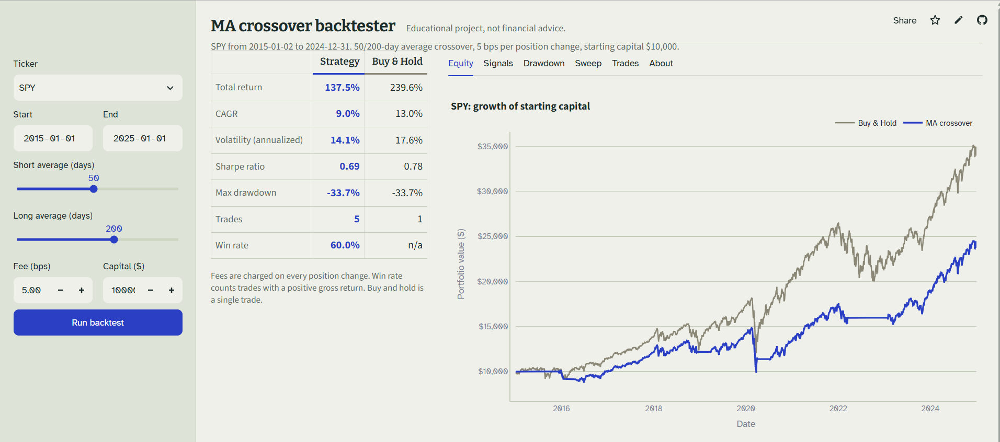
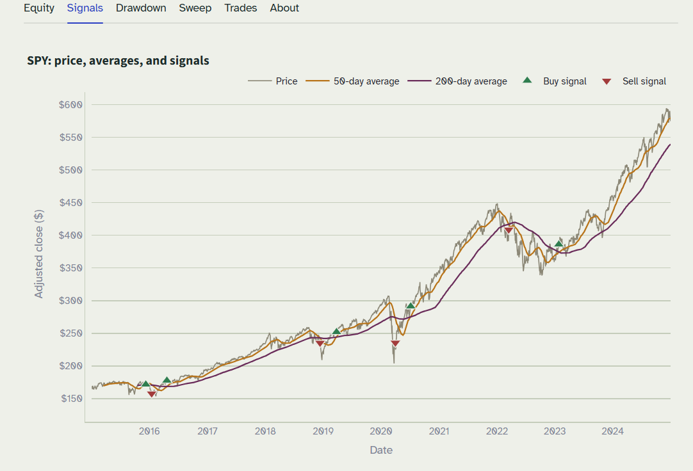
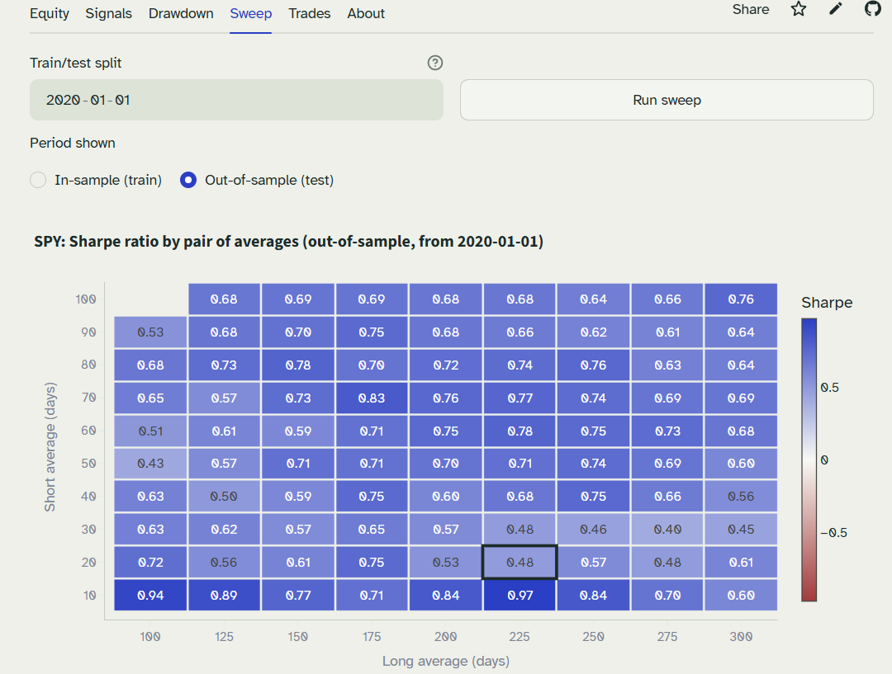

# Moving-Average Crossover Backtester

Test a moving-average crossover trading rule on real historical prices, with trading costs, a buy-and-hold comparison, and an out-of-sample check that shows how much of a backtest result is luck.

[](https://ma-backtester-anhad.streamlit.app/)

[](https://github.com/anhadg/Moving-Average-Crossover-Backtester/actions/workflows/ci.yml)




The app runs in the browser with nothing to install. If nobody has visited recently it may show a wake-up button. Click it and wait a few seconds.

## Key findings

On SPY from 2015 to 2024, a 50/200-day crossover with a 5 basis point fee returned 137.5% (9.0% a year), while buy-and-hold returned 239.6% (13.0% a year). The strategy was calmer, with 14.1% annualized volatility against 17.6%, but its Sharpe ratio was still lower at 0.69 against 0.78. Its maximum drawdown matched buy-and-hold at 33.7%, because the slow signal stayed invested through the March 2020 selloff and only exited on March 31, after the low. Fees barely mattered here since the rule made only five trades in ten years: total return was <<RETURN_AT_0_BPS>> with no fees and <<RETURN_AT_25_BPS>> at 25 basis points.

The out-of-sample test was the most useful result. Picking the best pair of windows on 2015 to 2019 gave 20/225 with a Sharpe ratio of 1.02. On 2020 to 2024 the same pair scored 0.48, ranked 85th out of 89 pairs, and trailed buy-and-hold's 0.75 over the same years. That gap is what overfitting looks like. One split on one ticker is not proof, and five trades is a small sample, so treat these numbers as a demonstration of the method and not a verdict on the strategy.

| SPY, 2015-01-02 to 2024-12-31 | Strategy | Buy & Hold |
|---|---|---|
| Total return | 137.52% | 239.57% |
| CAGR | 9.04% | 13.01% |
| Volatility (annualized) | 14.06% | 17.62% |
| Sharpe ratio | 0.69 | 0.78 |
| Max drawdown | -33.72% | -33.72% |
| Trades | 5 | 1 |
| Win rate | 60.00% | n/a |

Settings: 50/200-day simple moving averages, long or flat, 5 basis points per position change, $10,000 starting capital.

## Screenshots

 

The Signals tab marks each crossover. The Sweep tab shows the Sharpe ratio for every pair of windows, with the pair chosen on training data outlined.

## Try it

**In the browser:** [ma-backtester-anhad.streamlit.app](https://ma-backtester-anhad.streamlit.app/)

**On your machine:**

```bash
git clone https://github.com/anhadg/Moving-Average-Crossover-Backtester.git
cd Moving-Average-Crossover-Backtester
python -m venv .venv
source .venv/bin/activate        # Windows: .venv\Scripts\activate
pip install -r requirements.txt
streamlit run app.py
```

**From the command line:**

```bash
python backtest.py --ticker SPY --short 50 --long 200 --fee-bps 5 --start 2015-01-01 --end 2025-01-01
python backtest.py --ticker SPY --sweep --split-date 2020-01-01
```

The first command prints a strategy versus buy-and-hold table and saves three charts to `assets/`. Adding `--sweep` runs the window sweep and saves a heatmap. Adding `--split-date` also runs the train/test analysis. Run `python backtest.py --help` for every option, including `--capital`, `--out-dir`, `--no-charts`, and `--no-cache`.

## Features

- Downloads daily prices with `yfinance` and caches them to `data/{ticker}.csv`
- Moving-average crossover signals with adjustable windows, long or flat
- Simulation with a configurable fee in basis points on every position change
- Buy-and-hold benchmark over the same dates
- Metrics: total return, CAGR, annualized volatility, Sharpe ratio, max drawdown, trade count, win rate
- Parameter sweep across short and long windows, shown as a Sharpe heatmap
- Train/test split that chooses windows on early data and scores them on later data
- Web app with interactive Plotly charts, a sortable trades table with CSV download, and friendly error messages
- Command-line interface that runs the whole pipeline in one command

## How it works

Prices flow through five small modules: `data.py` loads them, `signals.py` computes the two averages and the signal, `engine.py` simulates the trades, `metrics.py` scores the results, and `plots.py` and `sweep.py` produce the charts and the parameter grid.

**No lookahead.** The position held on a given day is the signal from the previous day's close. A test in `tests/test_engine.py` changes only the final day's price and checks that no earlier result moves.

**Costs.** A fee in basis points is deducted on every day the position changes.

**Metric conventions.** Sharpe uses a 0% risk-free rate and daily returns scaled by the square root of 252. CAGR uses calendar years. Win rate counts trades with a positive gross price return, before fees. The strategy is flat while the long average warms up, and buy-and-hold is invested from day one.

**Train/test.** The best pair is chosen using only data before the split date. Its averages are then computed on the full history, so they are warmed up on the first test day, but only test-period returns are scored. The full grid uses 89 valid pairs (short windows 10 to 100, long windows 100 to 300). On the full ten years the best pair is 10/225 with a Sharpe of 0.88, slightly above buy-and-hold's 0.78, but that pair was picked with hindsight.

## Tech stack

Python 3.12+, pandas, NumPy, yfinance, Plotly, Matplotlib, Streamlit, pytest, ruff, GitHub Actions, Streamlit Community Cloud.

## Project structure

```
app.py               Streamlit web app
backtest.py          command-line entry point
src/
  data.py            download and CSV cache
  signals.py         moving averages and signal
  engine.py          simulation, trades table, train/test rebasing
  metrics.py         performance statistics
  plots.py           static and interactive charts
  sweep.py           parameter grid and train/test analysis
  theme.py           shared colors and fonts
tests/               pytest suite, including the lookahead test
assets/              screenshots and README charts
.streamlit/          app theme
.github/workflows/   CI: ruff and pytest on every push
```

## Tests

```bash
python -m pytest
ruff check .
```

CI runs both on every push and pull request.

## Limitations

- One asset at a time, long or flat only, no shorting or leverage
- Prices are adjusted daily closes from Yahoo Finance, which can contain errors and sometimes rate-limits requests
- No taxes, slippage, or costs beyond the fee you set
- Results describe the past and say nothing certain about the future

## Ideas for later

EMA option, RSI filter, stop-loss, position sizing, walk-forward analysis, Monte Carlo resampling, saved runs, and multi-ticker comparison.

## License and disclaimer

MIT License, see [LICENSE](LICENSE). This is an educational project and not financial advice.